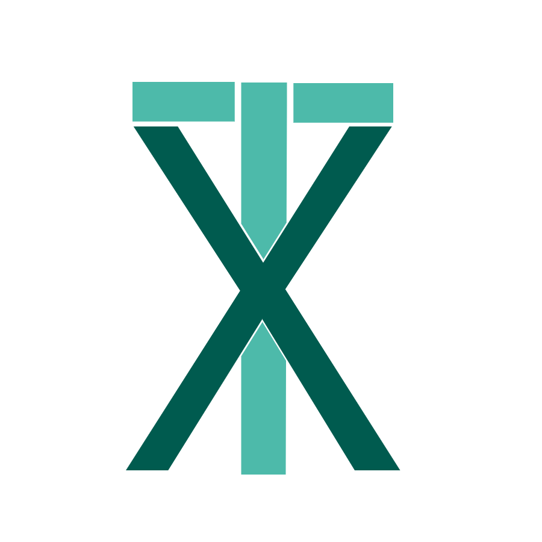
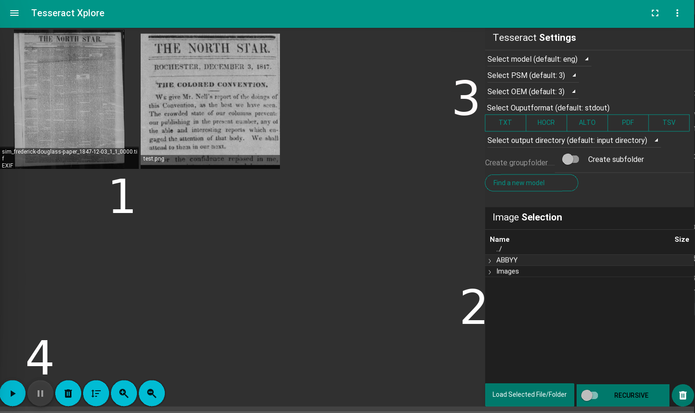
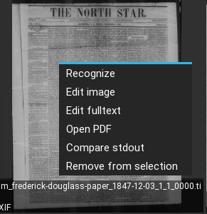
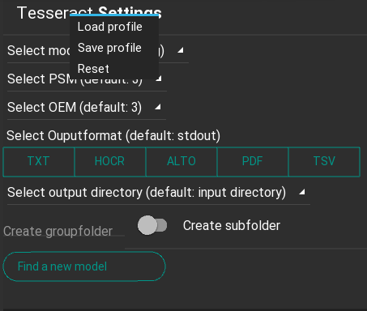
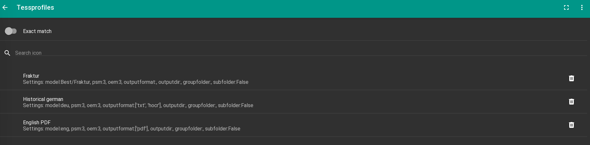
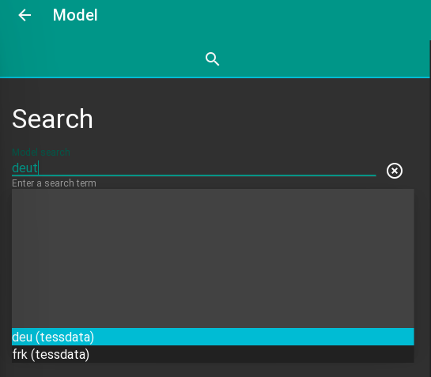
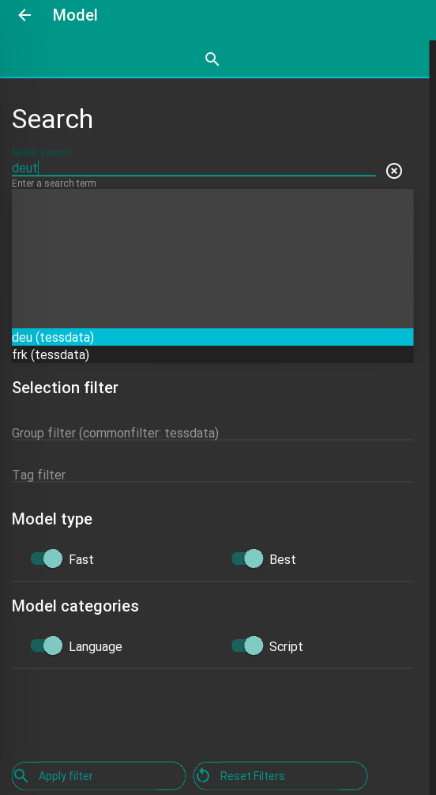
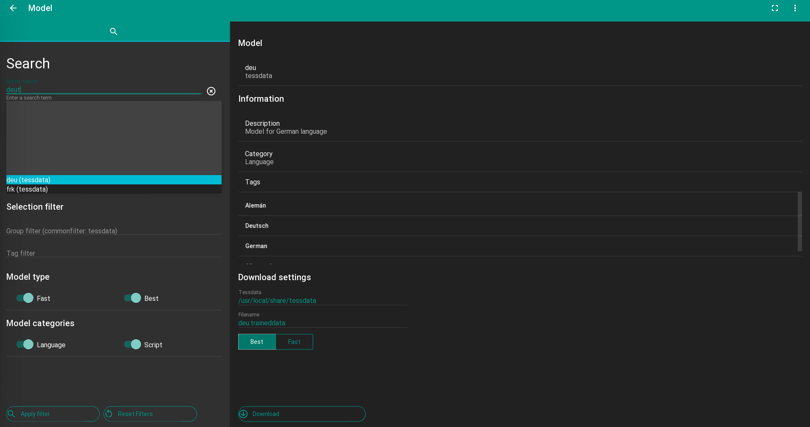

# TesseractXplore
[](https://travis-ci.org/JKamlah/tesseractXplore)
[](https://github.com/JKamlah/tesseractXplore/issues)

This tool provides a graphical interface to [tesseract](https://github.com/tesseract-ocr/tesseract). 
Images can be loaded via a file chooser window or drag-and-drop. The result fulltext-files can also be edited.

# Contents

* [Use Cases](#use-cases)
* [Development Status](#development-status)
* [Python Package](#python-package)
* [GUI](#gui)
    * [Usage](#gui-usage)
    * [Image Selection and OCR](#image-selection-and-ocr)
    * [Model Search](#model-search)
    * [Settings](#settings)
    * [Keyboard Shortcuts](#keyboard-shortcuts)
* [See Also](#see-also)

## Use Cases
The purpose of this project is to provide a gui application for tesseract with
some extras.

```
Application features
    ┣━ Do OCR (single or batchwise)
    ┣━ Save/Load tesseract settings
    ┣━ Open PDFs with external applications (Webbrowser,..) 
    ┣━ Convert PDF to images 
    ┣━ Edit images (Rotation, Coloradjustements,..)
    ┣━ Evaluate output (Character occurencies)
    ┣━ Compare results with different settings
    ┣━ Edit fulltext outputs (Text, ALTO, hOCR, TSV)
    ┗━ Ease-to-Use online search engine for new models
```


### Tesseract
[Tesseract](https://github.com/tesseract-ocr/tesseract) is a commandline based OCR engine. 
Tesseract has unicode (UTF-8) support, and can recognize more than 100 languages "out of the box".

There are several [3rdParty](https://tesseract-ocr.github.io/tessdoc/User-Projects-%E2%80%93-3rdParty.html) projects
to provide a gui for Tesseract, but they all lack in some way.

### Images 
Any image readable by Leptonica is supported in Tesseract including BMP, PNM, PNG, JFIF, JPEG, and TIFF. GIF and PDF is
not supported, but PDF can be converted to readable imageformats.

### Models 
The official models are divided into three types [tessdata_best](https://github.com/tesseract-ocr/tessdata_best), 
[tessdata_fast](https://github.com/tesseract-ocr/tessdata_fast) and [tessdata](https://github.com/tesseract-ocr/tessdata).

The models can be furthermore categorized into language (e.g. german) and script 
(e.g. latin) models. While script models are trained for a whole writing systems and the integrated dictionary is really broad, 
the language models are trained with a subset of a writing system and contains a language specific dictionary.

The models names are abbrevations as [deu](https://github.com/tesseract-ocr/tessdata_fast/raw/master/deu.traineddata) for the 
standard german (**deu**tsch) language model and further information to the models are hard to find.
The models need to be downloaded and installed to the tessdatapath.

Thats why, the application provides an online model search engine with more metadata information for each
model. Finding and installing new models are now easy and straight forward.


### Fulltext-fileformat 
Tesseract supports various output formats: plain text, hOCR (HTML), PDF, invisible-text-only PDF, TSV. 
The master branch also has experimental support for ALTO (XML) output.

The application allows to edit plain text, hOCR, ALTO and TSV and store the result for further use.

# Development Status
See [Issues](https://github.com/JKamlah/tesseract-xplore/issues?q=) for planned features and
current progress.

This is project is currently in an early development stage and not very polished. All the
features described below are functional, however.

# Python Package
See the wiki for details on the python package.

# Installation

It is recommended to use a virtual environment.

## Linux/MacOS

```
python3 -m venv venv
source venv/bin/activate
sudo apt-get install python3-sdl2
pip install --upgrade pip
pip install .[app]
```

If you use zsh-commandline you need to escape brackets with backslash!

## Win (cmd.exe)

For windows please use the current [installer](https://github.com/JKamlah/tesseractXplore/releases/latest/download/TesseractXploreSetup.exe).

```
python3 -m venv venv
venv\Scripts\activate.bat
pip install --upgrade pip
pip install .[all-win]
```

Don't install kivy-gstreamer on Windows!

<!---
OS-specific builds will be coming soon, but for now running it requires a local python development
environment. To install:
```
pip install tesseractXplore
```
Some additional dependencies are required on Windows:
```
pip install tesseractXplore[win]
```
-->

## Installation of an alternative text renderer (optional)

The standard text renderer can't display combined glyphs correctly, 
to do that an alternative text renderer needs to be used e.g. pango2:

1. Install pangoft2 (`apt install libfreetype6-dev libpango1.0-dev
   libpangoft2-1.0-0`) or ensure it is available in pkg-config
2. Recompile kivy. Check that pangoft2 is found `use_pangoft2 = 1`
3. Test it! Enforce the text core renderer to pango using environment variable:
   `export KIVY_TEXT=pango`

#  GUI

##  GUI Usage
Start the GUI:
```
tesseractXplore
```
### Image Selection and OCR 
The basic UI components are shown below:


1. Drag & drop images or folders into the window.
2. Or, select files via the file browser on the right
3. Enter tesseract settings 
4. Click the 'Run' button in the lower-left to recognize the selected images

Other things to do:
* **Middle-click** an image to remove it
* **Right-click** an image for a menu of more actions


### Save, load and reset tesseract settings


Sometimes it can be handy to have settings profiles like for historical documents with just one column.
The application allows to save settings into a profile with an individual name.
To reset the settings to default or to search and load user stored profiles.



### Model Search
If you don't have a suitable model, click the 'Find a new model' button to go to the model
search screen. You can start with searching by name, with autocompletion support:



You can also run a full search using the additional filters. For example, with group attributes (tessdata,..), 
tags (medival) or select the model type (Fast/Best) or category (Language/Script):



On the right side of the window is an information page with download option.



### Settings
There are also some settings to customize the application and global parameters.
And yes, there is a dark mode, because why not.

![Screenshot]

### Keyboard Shortcuts
Some keyboard shortcuts are included for convenience:

Key(s)          | Action                    | Screen
----            |----                       |----------
F11             | Toggle fullscreen         | All
Ctrl+O          | Open file chooser         | Image selection
Shift+Ctrl+O    | Open file chooser (dirs)  | Image selection
Ctrl+Enter      | Run image tagger          | Image selection
Ctrl+Enter      | Run model search          | Model search
Shift+Ctrl+X    | Clear selected images     | Image selection
Shift+Ctrl+X    | Clear search filters      | Model search
Ctrl+S          | Open settings screen      | All
Ctrl+Backspace  | Return to main screen     | All
Ctrl+Q          | Quit                      | All

## Contributors

### Code Contributors

- Jan Kamlah [@JKamlah](https://github.com/JKamlah) - Core developer
- Jordan Cook [@JWCook](https://github.com/JWCook ) - Creator of [naturtag](https://github.com/JWCook/naturtag)

### Contributors/Tester

This project exists thanks to all the people who contribute.
Thanks for all the testing and feeback.

- Philipp Zumstein [@zuphilip](https://github.com/zuphilip)
- Stefan Weil [@stweil](https://github.com/stweil)
- Benjamin Rosemann [@b2m](https://github.com/b2m)


# See Also
*  This project is based on [naturtag](https://github.com/JWCook/naturtag).

